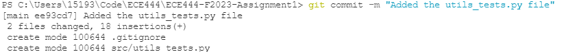
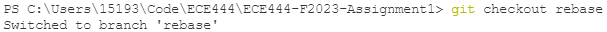
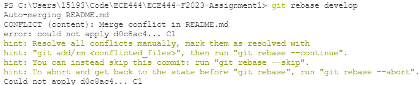
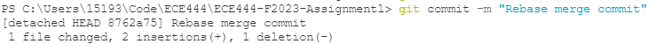
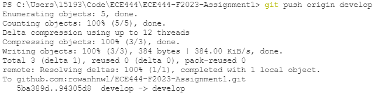
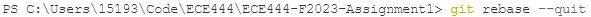

# **Rowan Honeywell** #

### **Initial READEME.md commit:** ###

### **Merging the develop branch:** ###

### **Resolved the pull request issues:** ###

### **Added the utils class and test files** ###

### **Rebasing branch rebase onto branch develop** ###

